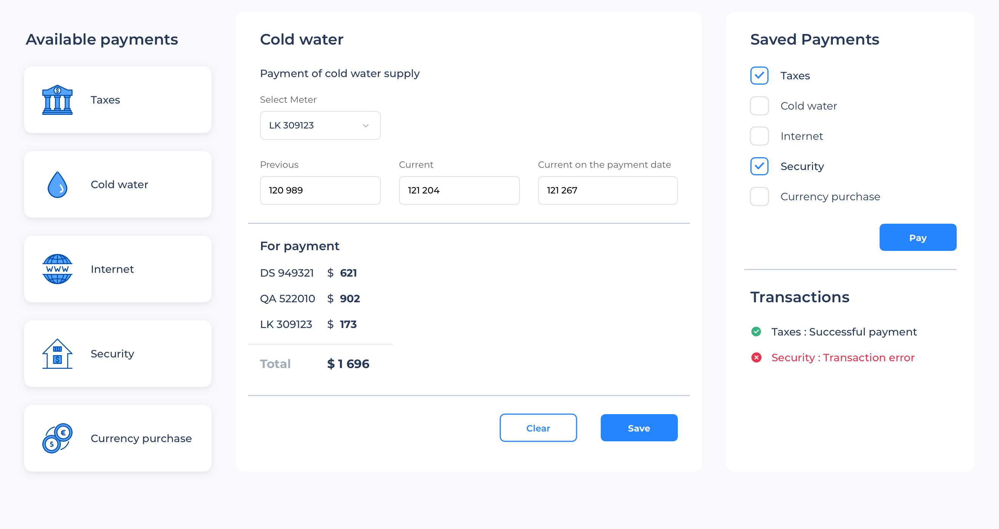

# Lectrum JS personal prject


### Installation

```
npm install
```

### Start Dev Server

```
npm start
```

### Build Prod Version

```
npm run build
```

### Features:

* ES6 Support via [babel](https://babeljs.io/) (v7)
* SASS Support via [sass-loader](https://github.com/jtangelder/sass-loader)
* Linting via [eslint-loader](https://github.com/MoOx/eslint-loader)


### Биллинговая система

